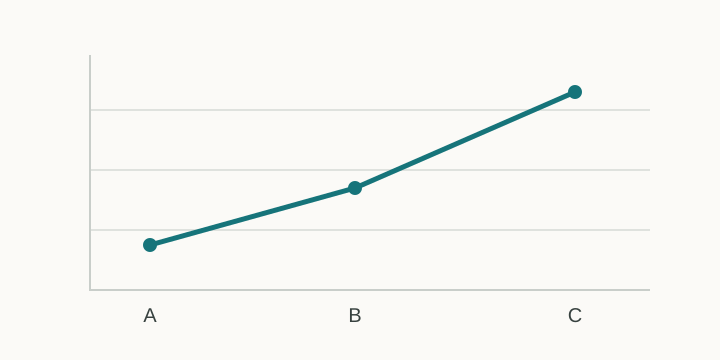

This draft checks the elements commonly used in a research note. 它只在带草稿参数的本地预览中出现，不会进入正式构建。

## Text, quotation, and lists

> A restrained layout should keep attention on the argument, not on decoration.

- English and 中文 can appear in the same paragraph.
- A long link should wrap inside the reading column: <https://example.com/a/very/long/path/that/is/only/here/to/check/how-the-layout-handles-unbroken-looking-links>.
- Literal currency uses a double-escaped dollar sign in the Markdown source: \\$20 and \\$35.

## Mathematics

Inline mathematics supports subscripts, superscripts, and backslashes: $\text{loss}_i = -\log p(y_i\mid x_i)$.

A displayed aligned expression:

$$
\begin{aligned}
L(\theta) &= \sum_{i=1}^{n} \ell(f_\theta(x_i), y_i) \\
R(\theta) &= L(\theta) + \lambda \lVert\theta\rVert_2^2
\end{aligned}
$$

A matrix:

$$
A = \begin{bmatrix}
1 & 0 & \alpha \\
0 & 1 & \beta
\end{bmatrix}.
$$

## Code

```python
def mean(values: list[float]) -> float:
    """Return the arithmetic mean of a non-empty sequence."""
    return sum(values) / len(values)
```

## Figure



## Table

| Setting | Purpose | Deliberately long value used to verify local horizontal scrolling |
|:--|:--|:--|
| `draft: true` | Keep work out of production | `this-is-a-long-unbroken-table-value-that-must-not-expand-the-whole-page-beyond-the-viewport` |
| `math: true` | Load the local math renderer | KaTeX is loaded only on pages that request it. |

## Footnote

Footnotes are useful for qualifications that would interrupt the main argument.[^scope]

[^scope]: This is a formatting example, not a claim about any research result.
